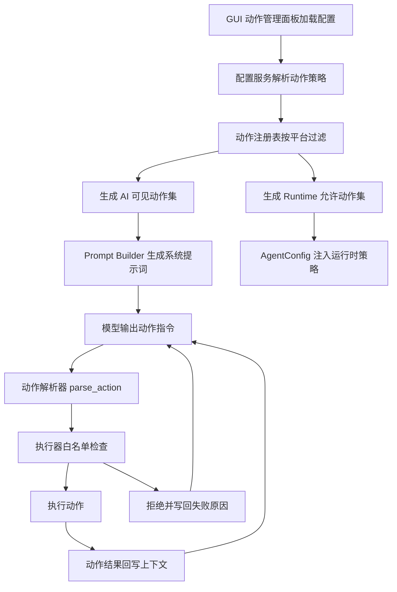

# 提示词管理与动作开关体系重构 Phase Spec（检查清单版）

> 评估基线：基于当前工作区中 [`phone_agent/config/`](../phone_agent/config/) 、 [`phone_agent/actions/`](../phone_agent/actions/) 、 [`gui/services/`](../gui/services/) 、 [`gui/pages/settings_page.py`](../gui/pages/settings_page.py) 、 [`main.py`](../main.py) 的现状整理。
>
> 目标：允许未来在 GUI 中以可配置、可持久化、可测试的方式管理 AI 可见动作与运行时可执行动作，并同步完成提示词基础设施的系统化重构。
>
> 复选框说明：
> - `[x]` 已完成
> - `[ ]` 未完成或尚未达到本方案验收标准
> - 若为部分完成，会在条目后补充说明

---

## 一、总体目标

- [x] 将当前分散在 [`phone_agent/config/prompts.py`](../phone_agent/config/prompts.py) 、 [`phone_agent/config/prompts_zh.py`](../phone_agent/config/prompts_zh.py) 、 [`phone_agent/config/prompts_en.py`](../phone_agent/config/prompts_en.py) 、 [`phone_agent/config/prompts_thirdparty.py`](../phone_agent/config/prompts_thirdparty.py) 的提示词文本，重构为可组合、可裁剪、可注入策略的提示词基础设施。
- [x] 建立统一的动作注册与能力描述层，不再依赖多个文件中手写重复动作清单。
- [x] 在 GUI 中新增“AI 可用动作管理”区域，允许用户通过勾选项控制哪些动作对 AI 可见、哪些动作允许运行时执行。
- [x] 配置需持久化，并通过 [`gui/services/config_service.py`](../gui/services/config_service.py) 、 [`gui/services/task_service.py`](../gui/services/task_service.py) 、 [`main.py`](../main.py) 传递到 Agent 运行时。
- [x] 在执行层增加硬约束白名单，保证即使模型输出了被禁用动作，也不会真正执行。
- [x] 提示词层同步做软约束，使模型尽量只规划已启用动作。
- [x] Android ADB、HarmonyOS HDC、iOS XCTest 三条链路都能对动作能力进行统一描述，但允许平台差异化可用性。
- [x] 保持现有 CLI 与 GUI 的主流程兼容，避免一次性打断当前可用能力。

---

## 二、当前架构痛点评估

### 1. 提示词定义分散且耦合高

- [ ] 提示词文本目前以“大段常量字符串”为主，缺少结构化拼装能力。
- [ ] 默认中文、英文、第三方模型提示词之间存在重复动作说明，后续维护成本高。
- [ ] 提示词内容与动作执行器允许集没有统一权威来源，容易产生“提示词说能用，但执行器不一定支持”的偏差。
- [ ] 第三方提示词工程与原生提示词工程在架构层没有统一接口，只是在 [`phone_agent/agent.py`](../phone_agent/agent.py) 中做选择。

### 2. 动作协议存在多处重复定义

- [ ] 动作允许集散落在 [`phone_agent/actions/handler.py`](../phone_agent/actions/handler.py) 与 [`phone_agent/actions/handler_ios.py`](../phone_agent/actions/handler_ios.py) 的 handler 映射中。
- [ ] 文档与提示词里存在动作清单，但不是唯一真源。
- [ ] 平台能力差异目前通过执行器内部自然分叉体现，而不是显式动作能力模型。
- [ ] 缺少统一位置为每个动作声明：名称、参数格式、平台支持、默认启用状态、风险级别、提示词展示文案。

### 3. GUI 层已有布尔配置，但缺少动作级配置体系

- [x] [`gui/pages/settings_page.py`](../gui/pages/settings_page.py) 已有布尔开关控件与配置表单承载能力。
- [x] [`gui/services/config_service.py`](../gui/services/config_service.py) 已能持久化配置、构建 CLI 参数。
- [ ] 当前配置项仍是少量固定字段，缺少适合动作矩阵的存储结构与渲染模式。
- [ ] 缺少用于“动作勾选区”的配置模型、平台过滤逻辑、默认值策略与兼容迁移。

### 4. 运行时缺少显式白名单机制

- [ ] 当前 Agent 主要依赖提示词约束模型输出。
- [ ] [`parse_action()`](../phone_agent/actions/handler.py) 解析后直接交给执行器，尚无统一“动作是否被启用”的硬拦截层。
- [ ] 若未来加入 GUI 勾选区，仅改提示词无法保证安全与一致性。

---

## 三、目标架构

```mermaid
flowchart TD
    A[Config Store] --> B[Action Capability Registry]
    B --> C[Prompt Policy Builder]
    B --> D[Runtime Action Policy]
    A --> C
    A --> D
    C --> E[AgentConfig or IOSAgentConfig]
    D --> F[ActionHandler or IOSActionHandler]
    E --> G[Model Request Messages]
    G --> H[AI Output]
    H --> I[parse_action]
    I --> F
    A --> J[GUI Settings Action Panel]
    B --> J
```



- [ ] 建立 `Config Store -> Action Capability Registry -> Prompt Policy Builder` 主链路。
- [ ] 建立 `Config Store -> Runtime Action Policy -> ActionHandler` 主链路。
- [ ] GUI 的动作勾选区直接消费动作注册表元数据，而不是手写重复复选框。
- [ ] Prompt 与 Runtime 都从同一份动作能力注册表派生，避免双重维护。
- [ ] 默认策略明确区分：AI 可见动作、运行时允许动作、平台实际支持动作。

---

## 四、核心设计原则

### 1. 单一真源

- [ ] 每个动作只在一个权威注册层声明元信息。
- [ ] 提示词动作清单、GUI 展示、运行时白名单、文档导出都从该注册层派生。

### 2. 软约束与硬约束分层

- [ ] 提示词层负责“告诉模型什么可用”。
- [ ] 运行时层负责“强制系统只执行被允许的动作”。
- [ ] 当两者冲突时，以运行时白名单为最终裁决。

### 3. 平台差异显式建模

- [ ] Android ADB、HarmonyOS HDC、iOS XCTest 的动作支持情况需要结构化表达。
- [ ] GUI 中不能向当前平台暴露不可执行动作，或至少要清晰标注不可用状态。

### 4. 渐进迁移

- [ ] 第一阶段允许保留旧提示词文件作为兼容层。
- [ ] 第二阶段再逐步收口到新的 Prompt Builder。
- [ ] CLI 老参数与 `.env` 旧字段应尽量兼容。

---

## 五、建议模块拆分

## 1. 动作能力注册层

### 建议新增

- [ ] 新增 [`phone_agent/actions/registry.py`](../phone_agent/actions/registry.py) 作为动作能力注册中心。
- [ ] 新增动作元数据结构，例如 `ActionSpec` 、 `ActionParamSpec` 、 `PlatformSupport` 。
- [ ] 每个动作需声明：
  - [ ] `name`
  - [ ] `label`
  - [ ] `category`
  - [ ] `description`
  - [ ] `prompt_signature`
  - [ ] `platforms`
  - [ ] `default_enabled`
  - [ ] `risk_level`
  - [ ] `visible_to_ai_by_default`
  - [ ] `runtime_enabled_by_default`
- [ ] 支持导出当前平台可见动作列表。
- [ ] 支持导出提示词展示用动作说明片段。
- [ ] 支持导出 GUI 表单模型。

### 迁移要求

- [ ] [`ActionHandler._get_handler()`](../phone_agent/actions/handler.py) 与 [`IOSActionHandler._get_handler()`](../phone_agent/actions/handler_ios.py) 不再是动作真源，而只负责“动作名 -> 执行方法”的最终绑定。
- [ ] 注册层与执行层解耦，避免为了修改提示词而修改 handler 源码。

### 动作元数据 Schema 示例

- [ ] Schema 需要同时服务于 Prompt、GUI、Runtime、文档导出四个场景。
- [ ] Schema 设计应优先满足“稳定、可扩展、可序列化”，避免把运行时函数对象直接混入可持久化结构。

```python
from dataclasses import dataclass, field
from typing import Literal

PlatformName = Literal["adb", "hdc", "ios"]
RiskLevel = Literal["low", "medium", "high"]
ActionCategory = Literal[
    "navigation",
    "input",
    "app_control",
    "system",
    "coordination",
    "integration",
]


@dataclass(frozen=True)
class ActionParamSpec:
    name: str
    type: str
    required: bool = True
    description: str = ""
    example: str = ""


@dataclass(frozen=True)
class ActionPromptSpec:
    signature: str
    summary_zh: str
    summary_en: str
    rules: tuple[str, ...] = ()
    examples: tuple[str, ...] = ()


@dataclass(frozen=True)
class ActionSupportSpec:
    platforms: tuple[PlatformName, ...]
    visible_to_ai_by_default: bool = True
    runtime_enabled_by_default: bool = True
    allow_in_thirdparty_prompt: bool = True
    allow_in_minimal_prompt: bool = True


@dataclass(frozen=True)
class ActionSpec:
    name: str
    label: str
    category: ActionCategory
    risk_level: RiskLevel
    description: str
    params: tuple[ActionParamSpec, ...] = ()
    prompt: ActionPromptSpec | None = None
    support: ActionSupportSpec | None = None
    tags: tuple[str, ...] = ()
    aliases: tuple[str, ...] = ()
    sort_order: int = 0
```

- [ ] `ActionSpec.name` 作为全局唯一主键，同时作为 CLI、配置、日志、执行器绑定的标准动作名。
- [ ] `label` 用于 GUI 展示，允许未来做国际化映射。
- [ ] `category` 用于 GUI 分组与权限策略分层。
- [ ] `risk_level` 用于高风险动作默认关闭、警示样式与确认机制。
- [ ] `params` 描述动作参数结构，用于文档导出、调试校验与未来更强的参数验证。
- [ ] `prompt.signature` 作为提示词中展示给模型的标准动作签名。
- [ ] `prompt.summary_zh` 与 `prompt.summary_en` 用于多语言提示词拼装。
- [ ] `support.platforms` 是平台能力上限，不允许被用户配置突破。
- [ ] `support.visible_to_ai_by_default` 与 `support.runtime_enabled_by_default` 用于生成默认策略。
- [ ] `tags` 用于筛选，例如 `safe` 、 `experimental` 、 `manual_assist` 、 `api_related` 。
- [ ] `aliases` 用于兼容旧动作名或历史拼写。

### `ActionSpec` 实例建议

```python
ACTION_TAP = ActionSpec(
    name="Tap",
    label="点击",
    category="navigation",
    risk_level="low",
    description="点击屏幕上的相对坐标点",
    params=(
        ActionParamSpec(
            name="element",
            type="list[int]",
            required=True,
            description="二维相对坐标，范围 0-999",
            example="[500, 500]",
        ),
    ),
    prompt=ActionPromptSpec(
        signature='do(action="Tap", element=[x, y])',
        summary_zh="点击指定坐标",
        summary_en="Tap the specified coordinate",
        rules=("坐标必须为整数", "坐标范围为 0-999"),
        examples=('do(action="Tap", element=[500, 500])',),
    ),
    support=ActionSupportSpec(
        platforms=("adb", "hdc", "ios"),
        visible_to_ai_by_default=True,
        runtime_enabled_by_default=True,
        allow_in_thirdparty_prompt=True,
        allow_in_minimal_prompt=True,
    ),
    tags=("safe", "core"),
    aliases=(),
    sort_order=100,
)
```

### 运行时绑定建议

- [ ] 注册表只保存元数据，不直接保存实例方法引用。
- [ ] 执行器内部维持 `action_name -> handler method` 绑定表，但要求动作名必须来自 `ActionSpec.name`。
- [ ] 若未来需要更强约束，可新增 `ExecutionBindingRegistry` 负责校验“注册表声明”与“执行器实现”是否齐全。

---

## 2. 提示词基础设施层

### 建议新增

- [ ] 新增 [`phone_agent/prompts/`](../phone_agent/) 子体系，承接提示词拼装职责。
- [ ] 建议拆分为以下概念：
  - [ ] `prompt_templates.py`：基础段落模板
  - [ ] `prompt_policy.py`：根据配置与平台生成提示词策略
  - [ ] `prompt_builder.py`：最终拼接 system prompt 与上下文片段
  - [ ] `prompt_sections.py`：动作协议、规则、示例等分段组件
- [ ] 为原 [`phone_agent/config/prompts_zh.py`](../phone_agent/config/prompts_zh.py) 、 [`phone_agent/config/prompts_en.py`](../phone_agent/config/prompts_en.py) 、 [`phone_agent/config/prompts_thirdparty.py`](../phone_agent/config/prompts_thirdparty.py) 建立兼容适配层，而不是立即全部删除。

### 重构目标

- [ ] 中文、英文、第三方模型提示词都由统一接口生成。
- [ ] 动作清单不再手写在多个字符串常量里，而是由动作注册层动态生成。
- [ ] 支持按平台裁剪动作列表。
- [ ] 支持按用户配置裁剪动作列表。
- [ ] 支持区分原生 AutoGLM 与第三方模型的不同格式策略。
- [ ] 支持未来扩展更多提示词策略，例如安全模式、极简模式、调试模式。

### 兼容目标

- [ ] [`get_system_prompt()`](../phone_agent/config/__init__.py:19) 可继续存在，但内部改为委托新 Prompt Builder。
- [ ] [`phone_agent/agent.py`](../phone_agent/agent.py) 对调用侧尽量少改，只替换提示词来源与配置注入方式。
- [ ] iOS 与 Android 主流程保持接口对齐。

---

## 3. 配置模型层

### 建议新增配置项

- [ ] 新增 AI 动作管理配置字段。
- [ ] 新增运行时动作白名单配置字段。
- [ ] 新增动作配置版本号字段，用于未来迁移。
- [ ] 新增可选的“使用平台默认动作集”开关。

### 配置形态建议

- [ ] 优先采用 JSON 字符串持久化复杂动作集合，而不是扩展成几十个独立 `.env` 布尔字段。
- [ ] 建议区分以下概念：
  - [ ] `OPEN_AUTOGLM_AI_VISIBLE_ACTIONS`
  - [ ] `OPEN_AUTOGLM_RUNTIME_ENABLED_ACTIONS`
  - [ ] `OPEN_AUTOGLM_ACTION_POLICY_VERSION`
- [ ] 若需要简单兼容，可提供“当配置为空时回落到注册表默认值”的策略。

### 配置服务改造

- [ ] [`gui/services/config_service.py`](../gui/services/config_service.py) 需要支持读写动作集合型字段。
- [ ] 增加 JSON 解析、容错、默认值修复与迁移逻辑。
- [ ] 增加从当前设备平台推导有效动作集的辅助方法。
- [ ] 增加导出 CLI 参数的方法，例如 `--enabled-actions` 与 `--ai-visible-actions`。

---

## 4. CLI 与 AgentConfig 层

### `main.py`

- [ ] 新增 CLI 参数以接收动作策略。
- [ ] 新增参数解析与校验逻辑。
- [ ] 非法动作名、空动作集、平台不支持动作等情况要给出清晰错误。
- [ ] 保持旧参数兼容，不影响当前 `--thirdparty` 、 `--lang` 、 `--max-steps` 等链路。

### `AgentConfig` 与 `IOSAgentConfig`

- [ ] 在 [`phone_agent/agent.py`](../phone_agent/agent.py) 的 `AgentConfig` 中加入动作策略字段。
- [ ] 在 [`phone_agent/agent_ios.py`](../phone_agent/agent_ios.py) 的 `IOSAgentConfig` 中加入动作策略字段。
- [ ] Agent 初始化时即完成：
  - [ ] Prompt Policy 注入
  - [ ] Runtime Action Policy 注入
  - [ ] 平台动作有效性裁剪

---

## 5. 执行器硬约束层

### Android 与 HarmonyOS

- [ ] 在 [`phone_agent/actions/handler.py`](../phone_agent/actions/handler.py) 中增加运行时白名单拦截。
- [ ] 在动作解析后、真正执行前统一检查动作是否被允许。
- [ ] 被禁动作要返回结构化失败信息，而不是静默跳过。
- [ ] 连续遇到被禁动作时，Agent 的上下文中要能让模型感知失败原因并重规划。

### iOS

- [ ] 在 [`phone_agent/actions/handler_ios.py`](../phone_agent/actions/handler_ios.py) 中加入同等逻辑。
- [ ] iOS 平台不支持的动作需要在运行时明确拒绝，并在 GUI 中默认隐藏或禁用。

### 统一策略

- [ ] 执行器层不直接依赖 GUI，只依赖通用动作策略对象。
- [ ] 白名单检查逻辑在 Android/HarmonyOS 与 iOS 间尽量复用。

---

## 6. GUI 动作勾选区

### 设置页结构

- [ ] 在 [`gui/pages/settings_page.py`](../gui/pages/settings_page.py) 中新增“AI 动作管理”或“工具与动作管理”分组。
- [ ] 支持按类别分组展示动作，例如：
  - [ ] 导航类
  - [ ] 输入类
  - [ ] 应用控制类
  - [ ] 等待与接管类
  - [ ] 扩展能力类
- [ ] 支持显示动作描述、平台支持标记、风险标记。
- [ ] 支持“恢复默认”与“全选/全不选”操作。
- [ ] 支持区分以下两种视图方案，二选一或并存：
  - [ ] 单层勾选：同一套配置同时作用于 AI 可见与运行时允许
  - [ ] 双层勾选：区分 AI 可见 与 Runtime 允许

### 交互要求

- [ ] 切换渠道或模型时，不强制覆盖用户已保存的动作开关。
- [ ] 切换平台时，能自动过滤不可用动作。
- [ ] 若当前配置包含本平台不支持动作，要显示兼容提示。
- [ ] UI 渲染应基于动作注册表自动生成，而不是手写每个勾选框。

### 持久化要求

- [ ] 修改后即时保存到配置服务。
- [ ] 重启 GUI 后可恢复。
- [ ] 从旧配置升级到新配置时有默认迁移逻辑。

## 7. i18n 适配规划

### GUI i18n 接入原则

- [ ] 新增“动作管理”区域必须完全接入 [`I18nManager.t()`](gui/i18n/manager.py:93) 键体系，不允许在 [`gui/pages/settings_page.py`](gui/pages/settings_page.py:501) 中硬编码中文标签。
- [ ] 新增设置页控件必须通过 [`SettingsPage.apply_i18n()`](gui/pages/settings_page.py:501) 在运行时响应语言切换。
- [ ] 新增页面级文案键延续现有 `page.settings.*` 命名约定，避免产生第二套动作管理命名空间风格。
- [ ] 动作勾选区标题、分类标题、帮助说明、风险提示、恢复默认按钮、全选与清空按钮都必须具备中英文词条。

### 动作元数据与 i18n 的边界

- [ ] `ActionSpec` 结构中的 `label` 与 `description` 不应直接固化为最终展示文案，应支持映射为稳定 i18n key。
- [ ] 建议动作注册表额外提供 `i18n_key_prefix`，例如 `action.tap` 、 `action.launch` 、 `action.call_api`。
- [ ] 动作元数据至少要能派生以下键：
  - [ ] `action.<name>.label`
  - [ ] `action.<name>.description`
  - [ ] `action.<name>.hint`
- [ ] GUI 不直接展示注册表原始英文常量，而是优先通过 i18n key 渲染；缺词时再回退到注册表默认文案。

### Prompt 多语言策略

- [ ] GUI i18n 与 Agent Prompt 语言需要分层处理，不应混为同一词典。
- [ ] GUI 文案继续走 [`gui/i18n/locales/cn.py`](gui/i18n/locales/cn.py) 与 [`gui/i18n/locales/en.py`](gui/i18n/locales/en.py)。
- [ ] Agent 运行时提示词继续按 [`get_system_prompt()`](phone_agent/config/__init__.py:19) 所使用的语言配置生成，但内部改造后应由新的 Prompt Builder 接管。
- [ ] 动作协议的提示词摘要建议在注册表中维护 `summary_zh` 与 `summary_en`，而不是复用 GUI 词典。
- [ ] 第三方模型提示词、原生提示词、极简提示词在多语言上应共享同一动作语义源，但允许格式模板不同。

### 运行时错误与诊断 i18n

- [ ] 执行器白名单拒绝、平台不支持、参数非法、未知动作等错误，需要区分“内部错误码”与“用户可读文案”。
- [ ] 内部错误码建议保持稳定英文枚举，例如 `ActionDisabled` 、 `PlatformNotSupported` 、 `InvalidActionArgs` 、 `UnknownAction`。
- [ ] CLI 与 Agent 控制台输出继续使用 [`phone_agent/config/i18n.py`](phone_agent/config/i18n.py:54) 风格的轻量消息层，必要时扩展动作策略相关消息键。
- [ ] GUI 历史页、诊断页、设置页提示应走 GUI i18n 词典，不直接复用 CLI 消息字典。
- [ ] 日志记录中保留稳定动作名与错误码，界面展示时再做本地化映射，保证检索与调试稳定。

### 缺词与回退策略

- [ ] 若 GUI 词典缺失动作文案键，优先显示 `[[key]]` 占位，遵循 [`I18nManager`](gui/i18n/manager.py:37) 当前机制，便于快速补词。
- [ ] 若动作注册表未提供专用 i18n key，则回退到注册表默认 `label` 与 `description`，避免设置页完全空白。
- [ ] 若 Prompt Builder 缺失目标语言摘要，则中文优先回退到 `summary_zh`，英文优先回退到 `summary_en`，最后才回退到动作名本身。
- [ ] 所有回退都应在日志中可观测，便于后续统一补齐词条。

### 词典组织建议

- [ ] GUI locale 中新增统一动作管理词条分组，例如：
  - [ ] `page.settings.actions.title`
  - [ ] `page.settings.actions.description`
  - [ ] `page.settings.actions.category.navigation`
  - [ ] `page.settings.actions.category.input`
  - [ ] `page.settings.actions.btn.reset_defaults`
  - [ ] `page.settings.actions.btn.select_all`
  - [ ] `page.settings.actions.btn.clear_all`
  - [ ] `page.settings.actions.mode.ai_visible`
  - [ ] `page.settings.actions.mode.runtime_enabled`
- [ ] 动作实体文案建议在 GUI locale 中独立分组，例如：
  - [ ] `action.tap.label`
  - [ ] `action.tap.description`
  - [ ] `action.launch.label`
  - [ ] `action.launch.description`
  - [ ] `action.call_api.label`
  - [ ] `action.call_api.description`
- [ ] 风险等级建议单独抽象公共键，而不是每个动作重复一份，例如：
  - [ ] `action.risk.low`
  - [ ] `action.risk.medium`
  - [ ] `action.risk.high`

### 测试要求

- [ ] 为新增动作管理区域补充 GUI 语言切换测试，确保 [`PageI18nAdapter`](gui/i18n/page_adapter.py:25) 能驱动其重翻译。
- [ ] 为新增 locale 键补充缺词检测或最小覆盖测试。
- [ ] 为动作拒绝错误的 GUI 展示与 CLI 输出分别补充多语言测试。
- [ ] 为配置切换 `cn/en` 后动作管理区文案即时变化补充无头测试，延续 [`tests/test_gui_i18n_headless.py`](tests/test_gui_i18n_headless.py) 风格。

---

## 六、推荐 Phase 拆分

## Phase 0：基线梳理与冻结

- [ ] 盘点当前所有动作名称、参数格式、平台支持情况。
- [ ] 盘点当前所有提示词文本中的动作协议与规则片段。
- [ ] 确认哪些动作属于稳定公开能力，哪些属于实验能力。
- [ ] 补一份权威动作清单文档，作为重构期间对照表。

### 验收标准

- [x] 动作名称全集唯一且可列举。
- [x] 三个平台能力差异有书面表。
- [x] 现有提示词中的动作协议重复点已识别清楚。

---

## Phase 1：动作注册表落地

- [x] 新增动作注册层与元数据结构。
- [x] 将现有动作迁移到注册表中声明。
- [x] 为每个动作补齐分类、描述、平台支持与默认策略。
- [x] 提供面向 Prompt、GUI、Runtime 的三个导出接口。

### 验收标准

- [x] 不看 handler 映射，也能从注册表完整列出动作能力。
- [x] GUI 与 Prompt 都能从注册表读取动作清单。
- [x] 平台过滤结果稳定可测。

---

## Phase 2：提示词构建器重构

- [x] 新建 Prompt Builder 体系。
- [x] 重构中文提示词生成逻辑。
- [x] 重构英文提示词生成逻辑。
- [x] 重构第三方提示词生成逻辑。
- [x] 用统一接口替换当前直接引用大段字符串常量的方式。
- [x] 保留旧导出函数作为兼容层，避免一次性破坏调用方。

### 验收标准

- [x] 提示词文本可按语言、平台、第三方模式、动作开关动态生成。
- [x] 动作协议段落不再出现多份手写拷贝。
- [x] 默认生成结果与现有行为在主流程上保持兼容。

---

## Phase 3：动作策略配置与 CLI 接线

- [x] 在配置服务中加入动作集合字段。
- [x] 完成 `.env` 读写、JSON 容错、默认值回填。
- [x] 在 [`main.py`](../main.py) 中加入动作策略 CLI 参数。
- [x] 将动作策略注入 [`AgentConfig`](../phone_agent/agent.py) 与 [`IOSAgentConfig`](../phone_agent/agent_ios.py) 。
- [x] 保证 CLI 单独运行与 GUI 子进程运行两种模式都生效。

### 验收标准

- [x] CLI 可显式指定动作白名单。
- [x] GUI 启动任务时能把动作策略传入子进程。
- [x] 无配置时能稳定回退到默认动作集。

---

## Phase 4：执行器白名单硬约束

- [x] 在 Android/HarmonyOS 执行器中加入动作允许性检查。
- [x] 在 iOS 执行器中加入动作允许性检查。
- [x] 对被禁动作返回明确错误消息，并反馈给对话上下文。
- [x] 统一错误码或错误消息格式，便于后续日志分析。

### 验收标准

- [x] 被禁动作不会被真正执行。
- [x] 模型能收到清晰反馈并进行下一轮重规划。
- [x] 不同平台表现一致。

---

## Phase 5：GUI 动作勾选区落地

- [x] 在设置页中新增动作勾选区。
- [x] 根据动作注册表动态渲染控件。
- [x] 支持类别分组、平台过滤、默认恢复。
- [x] 支持保存与重新加载。
- [x] 必要时补充帮助说明与风险提示文案。

### 验收标准

- [x] 用户能在 GUI 中直观看到所有可配置动作。
- [x] 勾选变化能正确持久化。
- [x] 平台切换后动作展示逻辑正确。
- [x] UI 不需要为新增动作手写新控件。

---

## Phase 6：兼容迁移与文档同步

- [x] 兼容旧 `.env` 配置。
- [x] 为旧配置生成默认动作策略。
- [x] 更新 [`README.md`](../README.md) 、 [`README_en.md`](../README_en.md) 与相关文档。
- [x] 更新 [`docs/ai_tools_reference.md`](../docs/ai_tools_reference.md) ，说明动作策略与平台能力。
- [x] 说明 GUI 动作勾选的作用边界：AI 可见不等于一定执行，最终仍受运行时白名单控制。

### 验收标准

- [x] 老用户升级后无需手动修复配置即可运行。
- [x] 新文档能解释新架构与常见问题。

---

## Phase 7：测试与回归保障

- [x] 为动作注册表补充单元测试。
- [x] 为 Prompt Builder 补充快照测试或结构测试。
- [x] 为配置服务的动作字段读写补充测试。
- [x] 为 CLI 参数解析补充测试。
- [x] 为执行器白名单补充测试。
- [x] 为 GUI 动作勾选持久化补充测试。
- [x] 为平台过滤逻辑补充测试。

### 验收标准

- [x] 关键链路具备自动化测试覆盖。
- [ ] 至少覆盖以下场景：
  - [ ] 默认配置启动
  - [ ] 禁用单个动作
  - [ ] 禁用高风险动作
  - [ ] 平台不支持动作自动过滤
  - [ ] 第三方提示词模式下动作裁剪
  - [ ] GUI 重启后配置恢复

---

## 七、关键设计决策待确认

- [ ] 是否采用“单套动作开关同时作用于 AI 可见与运行时允许”，还是拆分为两套策略。
- [ ] 是否需要在 GUI 中暴露高风险动作的二次确认语义，例如 `Call_API` 。
- [ ] 动作配置是否允许按渠道预设区分，例如不同模型渠道拥有不同默认动作集。
- [ ] 动作配置是否允许按平台分别保存。
- [ ] 第三方模型提示词是否继续保留“极简模式”和“带思考模式”双轨。
- [ ] 是否需要把 `Note` 、 `Interact` 、 `Take_over` 这类非物理执行动作单独归类为“协同动作”。

---

## 八、推荐优先级

### P0

- [ ] 动作注册表
- [ ] Prompt Builder 基础骨架
- [ ] Runtime 白名单
- [ ] 配置字段与 CLI 接线

### P1

- [ ] GUI 动作勾选区
- [ ] 兼容迁移
- [ ] 文档更新

### P2

- [ ] 细粒度双层策略
- [ ] 风险分级与高级交互
- [ ] 渠道级默认动作模板

---

## 九、实施顺序建议

- [ ] 先做注册表，再做 Prompt Builder，不建议反过来。
- [ ] 先做 Runtime 白名单，再做 GUI 勾选区，避免 UI 先于安全约束落地。
- [ ] 先保证 CLI 可独立使用新动作策略，再接入 GUI。
- [ ] 文档与测试不要等到最后一起补，至少应伴随 Phase 4 与 Phase 5 同步推进。

---

## 十、最终交付标准

- [x] 新增动作只需在注册表中声明，即可自动进入 Prompt、GUI 与 Runtime 策略链路。
- [x] 用户可在 GUI 中稳定配置动作启用状态。
- [x] 配置可持久化、可迁移、可回退。
- [x] 提示词与执行器不再维护两份独立动作真源。
- [x] 被禁动作不会真实执行。
- [x] 三个平台的动作能力边界清晰可见。
- [x] 测试、文档、CLI、GUI 四条链路同步收口。

---

## 十一、规划完成后的期望完整逻辑

## 1. 端到端主流程



- [x] GUI 进入设置页时，从持久化配置加载动作策略，并与注册表做一次一致性校验。
- [x] 启动任务时，配置服务输出“当前平台有效策略”，通过 CLI 参数注入任务子进程。
- [x] Agent 初始化时生成两份有效集合：AI 可见动作集 与 Runtime 允许动作集。
- [x] Prompt Builder 仅向模型暴露 AI 可见动作集，减少无效规划。
- [x] 执行器最终只接受 Runtime 允许动作集，形成强约束闭环。
- [x] 执行结果与拒绝原因都进入上下文，模型可持续自纠错重规划。

## 2. 策略优先级与决策顺序

- [x] 优先级 P1 平台能力上限：动作必须先被平台注册表标记为支持。
- [x] 优先级 P2 Runtime 白名单：动作必须在运行时允许集合内。
- [x] 优先级 P3 AI 可见集合：动作可被模型规划但不等于必然执行。
- [x] 优先级 P4 提示词模板策略：仅影响模型偏好，不改变运行时硬边界。
- [x] 优先级 P5 模型自由决策：只能在前述边界内选择动作。

- [x] 目标态计算规则一：有效 Runtime 动作集 = 平台支持动作集 与 Runtime 配置动作集 的交集。
- [x] 目标态计算规则二：有效 AI 可见动作集 = 有效 Runtime 动作集 与 AI 可见配置动作集 的交集。
- [x] 目标态计算规则三：当 AI 可见配置缺失时，默认回落到有效 Runtime 动作集。
- [x] 目标态计算规则四：任何配置都不得突破平台注册表声明的能力上限。

## 3. 异常分支与处理闭环

- [ ] 分支 A 未知动作：解析成功但不在注册表，执行器拒绝并返回 UnknownAction 错误。
- [ ] 分支 B 已知但禁用：动作在注册表中存在但不在 Runtime 白名单，执行器拒绝并返回 ActionDisabled 错误。
- [ ] 分支 C 平台不支持：动作存在但当前平台不支持，执行器拒绝并返回 PlatformNotSupported 错误。
- [ ] 分支 D 参数非法：动作名合法但参数缺失或类型错误，返回 InvalidActionArgs 错误。
- [ ] 分支 E 提示词越界：模型输出未暴露动作，仍由 Runtime 白名单兜底拒绝。
- [ ] 分支 F 连续拒绝：若连续多次拒绝同类动作，Agent 在上下文中追加策略提示，促使模型切换路径。

- [ ] 所有拒绝分支都要产生结构化事件，供 GUI 历史页与诊断页检索。
- [ ] 所有拒绝分支都要具备用户可读文案与开发可读错误码。

## 4. 回退策略与兼容保障

- [ ] 回退 R1 配置解析失败：动作策略字段 JSON 非法时，自动回退到平台注册表默认策略并提示修复。
- [ ] 回退 R2 新字段缺失：旧 `.env` 无动作策略字段时，自动注入默认值并保持任务可运行。
- [ ] 回退 R3 Prompt Builder 异常：新构建器失败时，临时回退到旧提示词导出路径保证可用性。
- [ ] 回退 R4 注册表异常：读取注册表失败时，禁止执行高风险动作并仅保留最小安全动作集。
- [ ] 回退 R5 平台识别异常：无法识别平台时，进入保守策略，仅允许通用低风险动作。

- [x] 兼容 C1 保持现有 CLI 参数有效，新增参数采用可选方式渐进接入。
- [x] 兼容 C2 保持 GUI 旧配置可读，迁移后写回新配置结构。
- [ ] 兼容 C3 在日志中明确标记当前运行于新策略模式或兼容回退模式。

## 5. 可观测性与运维诊断

- [ ] 日志字段 L1 记录动作名、平台、来源步骤、是否在 AI 可见集合。
- [ ] 日志字段 L2 记录是否在 Runtime 白名单、拒绝原因、错误码。
- [ ] 日志字段 L3 记录本次有效策略版本、配置版本、注册表版本。
- [ ] 日志字段 L4 记录 Prompt Builder 所用模板类型与动作裁剪结果数量。

- [ ] 指标 M1 动作执行成功率。
- [ ] 指标 M2 动作拒绝率与拒绝原因分布。
- [ ] 指标 M3 模型重规划次数与连续失败次数。
- [ ] 指标 M4 平台维度的动作可用率与命中率。

- [ ] GUI 诊断页可展示最近任务的策略快照。
- [ ] GUI 历史页可回放每一步是“执行成功”还是“策略拒绝”。
- [ ] 支持导出一份任务策略报告，便于排查配置问题。

## 6. 目标态验收场景

- [x] 场景 S1 用户在 GUI 禁用 `Call_API` 后，模型输出该动作会被稳定拒绝，且任务继续可恢复。
- [x] 场景 S2 用户仅开放导航与输入动作时，Prompt 内容只展示对应动作。
- [x] 场景 S3 Android 可用动作在切换到 iOS 后自动过滤，不产生无效勾选残留执行。
- [x] 场景 S4 升级前旧配置可直接启动任务，系统自动生成默认动作策略。
- [ ] 场景 S5 Prompt Builder 人为故障注入后，系统可回退兼容路径且主流程不中断。
- [ ] 场景 S6 诊断日志可完整追踪一次动作被拒绝到模型重规划再成功执行的闭环。

## 7. 目标态默认决策建议

- [ ] 默认采用双层策略：AI 可见动作 与 Runtime 允许动作分离。
- [ ] 默认 Runtime 集合小于等于 AI 可见集合，防止模型看到不能执行的动作。
- [ ] 高风险动作默认关闭，需用户显式启用。
- [ ] 平台专有动作默认按平台注册表自动裁剪，不要求用户手动理解平台差异。
