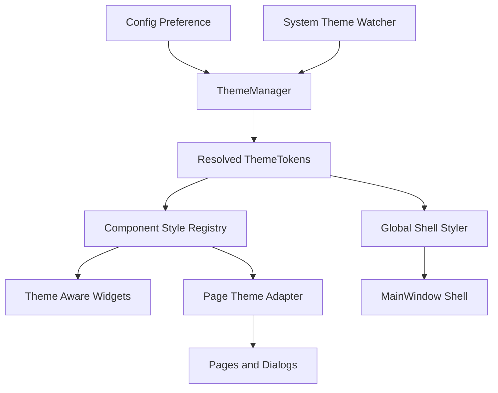

# ThemeEngine 重构方案

## 目标

把当前分散在主窗口、页面、局部 helper 里的主题切换逻辑，重构为一套可扩展、可测试、可渐进迁移的 ThemeEngine 基础设施。

重点解决以下问题：

- 全局 QSS 与页面局部样式并存，优先级不稳定
- 主题变量是大字典，语义边界不清晰
- 页面各自实现 `on_theme_changed`，风格不统一
- 跟随系统主题只是在切换时读取一次，而非持续监听
- 组件状态、业务状态、视觉状态耦合严重
- 新增页面、弹窗、组件时，主题适配成本高

---

## 当前架构痛点

### 1. 入口职责过重

当前主题入口集中在 `MainWindow.apply_theme`，同时负责：

- 解析主题偏好
- 解析 system 主题的实际模式
- 组装主题变量
- 渲染全局 QSS
- 推送页面级 `on_theme_changed`
- 更新部分导航和壳层局部样式

这会导致主题系统无法独立演进，也不利于测试。

### 2. 机制混杂

当前至少有三套机制同时存在：

- 全局 QSS
- 页面级 `on_theme_changed`
- 局部 helper 直接生成 `setStyleSheet`

这种混合模式在短期可修问题，但长期一定会导致：

- 谁是主题权威来源不清晰
- 组件样式规则无法预测
- 同一语义按钮在不同页面表现不同

### 3. 缺少统一语义层

目前主题变量直接以 `accent`、`border`、`warning_bg` 等原始键暴露给页面，页面可以任意组合，缺少约束。

长期来看，应当转为：

- 基础色板 tokens
- 语义 tokens
- 组件 tokens

页面只消费组件语义，不直接拼原始颜色。

---

## 未来目标架构

---

## 模块拆分方案

## 一、主题核心层

### 1. `gui/theme/tokens.py`

职责：

- 定义主题令牌结构
- 定义颜色、间距、圆角、字体、状态色等数据模型
- 把当前无约束的 dict 升级为明确字段的主题对象

建议结构：

- `BasePalette`
- `SemanticColors`
- `ComponentTokens`
- `ThemeTokens`

建议要求：

- 页面不能直接构造或修改 tokens
- 所有组件样式只能消费 `ThemeTokens`
- 保证字段命名稳定，避免字符串键散落全项目

### 2. `gui/theme/themes.py`

职责：

- 定义内置主题
- 提供 light、dark、未来品牌主题或高对比度主题

建议内容：

- `build_light_theme_tokens`
- `build_dark_theme_tokens`
- `resolve_theme_tokens`

扩展方向：

- 支持品牌定制
- 支持用户主题包
- 支持高对比度无障碍主题

### 3. `gui/theme/preferences.py`

职责：

- 定义主题偏好枚举
- 管理 `system / light / dark / custom`
- 统一配置映射逻辑

建议结构：

- `ThemePreference`
- `ResolvedThemeMode`

### 4. `gui/theme/system_watcher.py`

职责：

- 监听系统深浅色变化
- 对 Windows 主题切换做统一封装
- 触发主题管理器刷新

建议要求：

- 与 UI 解耦
- 只负责检测与发信号，不做样式应用
- 在不可监听的平台上降级为轮询或手动刷新

### 5. `gui/theme/manager.py`

职责：

- 作为整个主题系统唯一入口
- 管理当前主题偏好和当前解析后的 tokens
- 向 UI 广播 `theme_changed`
- 协调配置层与系统监听层

建议公开能力：

- `set_preference`
- `get_preference`
- `get_resolved_mode`
- `get_tokens`
- `refresh_from_system`
- `theme_changed` signal

关键原则：

- 主窗口不再负责主题解析
- 页面不直接读取配置服务判断当前主题
- 所有主题变化都经 ThemeManager 广播

---

## 二、样式基础设施层

### 6. `gui/theme/global_shell.py`

职责：

- 只负责应用壳层全局样式
- 包括窗口背景、导航区、容器、滚动条、基础分隔线

不再负责：

- 复杂业务按钮
- 页面局部组件
- 弹窗业务按钮层级

目标：

把当前巨大的 `_apply_global_style` 缩减为真正适合全局化的部分。

### 7. `gui/theme/component_registry.py`

职责：

- 统一注册组件语义样式生成器
- 按组件类型和语义名称返回样式

建议形式：

- `button.primary`
- `button.subtle`
- `button.danger`
- `input.default`
- `list.console`
- `banner.success`
- `dialog.surface`

关键价值：

- 页面不再自己拼 QSS
- 组件风格可以集中演进
- 将来支持切换实现策略

### 8. `gui/theme/styles/`

建议拆分子模块：

- `buttons.py`
- `inputs.py`
- `lists.py`
- `cards.py`
- `dialogs.py`
- `banners.py`
- `navigation.py`
- `shell.py`

每个模块只负责单一组件类别。

### 9. `gui/theme/contracts.py`

职责：

- 定义统一主题接口协议
- 约束页面、弹窗、语义组件如何响应主题变化

建议定义：

- `ThemeAware`
- `ThemeAwareWidget`
- `ThemeAwareDialog`

---

## 三、组件语义层

### 10. `gui/widgets/themed_button.py`

职责：

- 封装应用按钮
- 内部支持语义类型、尺寸、紧凑模式、禁用态、危险态、成功态
- 自动响应主题变化

建议接口：

- `set_variant`
- `set_compact`
- `set_theme_tokens`

未来页面中尽量不再直接 new 普通 `QPushButton` 再设置样式。

### 11. `gui/widgets/themed_input.py`

职责：

- 统一输入框样式、聚焦态、错误态、只读态

### 12. `gui/widgets/themed_list.py`

职责：

- 统一 console list、event list、普通 list 的视觉层级

### 13. `gui/widgets/themed_banner.py`

职责：

- 统一成功、警告、错误、信息横幅

### 14. `gui/widgets/themed_dialog.py`

职责：

- 为对话框提供统一主题外观
- 统一标题、说明文、操作按钮区的视觉规范

---

## 四、页面适配层

### 15. `gui/theme/page_adapter.py`

职责：

- 统一将 ThemeManager 广播的 tokens 应用到页面
- 调用页面定义的受控刷新入口

页面不再自行决定全部刷新顺序，而是由 adapter 驱动。

### 16. 页面统一接口约定

建议所有页面统一实现：

- `apply_theme_tokens(tokens)`
- `refresh_theme_surfaces()`
- `refresh_theme_states()`

含义：

- `apply_theme_tokens` 只接收主题对象并缓存
- `refresh_theme_surfaces` 刷容器、列表、面板等静态外观
- `refresh_theme_states` 刷按钮、状态横幅、运行态、禁用态等动态外观

这样可以取代当前风格不一的 `on_theme_changed`。

---

## 组件语义体系规划

## 按钮

统一语义：

- `primary`
- `secondary`
- `subtle`
- `success`
- `warning`
- `danger`
- `ghost`
- `link`

统一状态：

- default
- hover
- pressed
- disabled
- selected
- loading

统一尺寸：

- sm
- md
- lg
- compact

## 输入框

统一语义：

- default
- readonly
- invalid
- success
- search

## 列表

统一语义：

- default list
- console list
- event list
- side list

## 横幅

统一语义：

- info
- success
- warning
- error

## 对话框

统一语义：

- default dialog
- confirm dialog
- wizard dialog
- utility dialog

---

## 跟随系统主题机制重构

当前的 `system` 更接近“取值一次”。

未来建议：

1. ThemeManager 保存用户偏好为 `system`
2. SystemThemeWatcher 负责监听 Windows 主题变化
3. 当系统主题变化时，ThemeManager 重新解析实际 mode
4. ThemeManager 发出统一 `theme_changed(tokens)`
5. Shell 和页面统一响应，不允许各自重复判断系统主题

关键要求：

- 不在页面中直接读取 QApplication palette 推断主题
- 不在页面中重复写 `theme == system` 的逻辑
- system 主题的解析权只归 ThemeManager

---

## 测试体系规划

## 1. 主题切换单元测试

验证：

- `system / dark / light` 的解析逻辑正确
- tokens 生成稳定
- ThemeManager 在 preference 变化和系统主题变化时广播正确

## 2. 组件样式快照测试

验证：

- 按钮在 light / dark 下的 primary、danger、disabled 样式一致
- 输入框、列表、横幅、对话框样式一致

## 3. 关键页面截图回归

优先覆盖：

- DashboardPage
- DevicePage
- SettingsPage
- HistoryPage
- DiagnosticsPage
- QrCodeScanDialog
- QrPairDialog

建议做法：

- 每页浅色和深色各一组截图
- 关键状态额外覆盖
- 对比按钮填充、边框、禁用态、对比度

## 4. 主题切换流程测试

验证：

- 应用运行中切换主题不会丢状态
- 对话框打开时切换主题不会残留旧样式
- 列表、按钮、输入框不会局部失效

---

## 分阶段迁移顺序

## Phase 0 观测与护栏

目标：

- 先把当前主题问题可观测化
- 建立基准截图和关键页面清单

输出：

- 关键页面主题截图基线
- 主题热点页面列表
- 现有 variant 和局部 helper 清单

## Phase 1 建立 ThemeEngine 基础设施

目标：

- 新建 ThemeManager、ThemeTokens、SystemThemeWatcher、ComponentStyleRegistry
- 不立即大面积改页面

输出：

- 新主题基础设施落地
- 旧入口保留兼容层

## Phase 2 收缩全局 QSS

目标：

- 把壳层样式保留在 global shell
- 移除不稳定的复杂组件全局语义渲染逻辑

重点迁移：

- 按钮 variant 的复杂规则
- 对话框按钮样式
- 部分页内 role + variant 混搭逻辑

## Phase 3 完成按钮系统迁移

目标：

- 用组件样式注册层或 ThemedButton 接管所有业务按钮

优先迁移页面：

1. DashboardPage
2. DevicePage
3. SettingsPage
4. HistoryPage
5. DiagnosticsPage

原因：

- 当前主题问题最集中
- 这些页面已经有局部样式化的现实基础

## Phase 4 输入框、列表、横幅、弹窗迁移

目标：

- 统一输入、列表、横幅和对话框体系

优先迁移：

- QrCodeScanDialog
- QrPairDialog
- QMessageBox 主题外观
- 各页面日志面板和状态横幅

## Phase 5 页面统一主题接口迁移

目标：

- 把现有分散的 `on_theme_changed` 迁移到统一页面主题接口
- 页面只描述主题应用点，不再自行决定全部 QSS 拼接细节

## Phase 6 系统主题监听上线

目标：

- 真正支持运行中跟随 Windows 深浅色切换
- 验证页面和对话框无残留状态

## Phase 7 清理兼容层

目标：

- 移除旧的 variant 依赖
- 移除冗余局部 helper
- 移除页面里残留的硬编码颜色

---

## 推荐实施顺序细化

### 第一步

先实现：

- `ThemeTokens`
- `ThemeManager`
- `themes.py`
- `component_registry.py`

但暂时保留现有页面 `on_theme_changed` 兼容。

### 第二步

把当前已有的按钮 helper 合并到统一组件样式层：

- 把 `gui/utils/button_styles.py` 升级为 `gui/theme/styles/buttons.py`
- 把 DashboardPage 内部重复按钮 helper 清出页面
- DevicePage 私有按钮 helper 改为统一引用组件样式层

### 第三步

迁移最容易出问题的页面：

- DashboardPage
- DevicePage

这两个页面覆盖了：

- 动态按钮状态
- 弹窗
- 输入框
- 列表
- 状态栏

它们适合作为重构样板。

### 第四步

迁移中低复杂页面：

- SettingsPage
- HistoryPage
- DiagnosticsPage

### 第五步

统一对话框与消息框体系：

- QrCodeScanDialog
- QrPairDialog
- QMessageBox
- 未来所有 utility dialogs

### 第六步

接入系统主题监听和截图回归。

---

## 迁移中的兼容策略

为了支持渐进替换，建议保留三层兼容：

### 兼容层 A

`MainWindow.apply_theme` 暂时继续存在，但内部逐步改为委托 ThemeManager。

### 兼容层 B

页面暂时仍可保留 `on_theme_changed`，但实现内部改为调用统一 adapter。

### 兼容层 C

保留旧按钮 helper 一段时间，但必须标记 deprecated，并限制新代码继续使用。

---

## 重构完成后的验收标准

- 主题偏好解析只有一个权威入口
- 系统主题监听只有一个权威入口
- 页面不再直接拼接核心语义按钮样式
- 新页面接入主题不需要复制旧页面 `on_theme_changed`
- 关键页面深浅色截图稳定
- 对话框与主页面主题表现一致
- 运行中切换主题不会出现局部残留和失效

---

## 推荐下一步实施任务

1. 搭建 `gui/theme/` 目录与核心数据结构
2. 将 `MainWindow.apply_theme` 重构为委托 ThemeManager
3. 将按钮样式迁移到统一的组件样式层
4. 用 DashboardPage 和 DevicePage 作为第一批迁移样板
5. 建立主题截图回归基线
