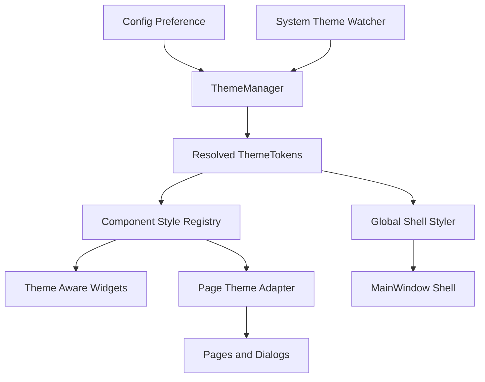

# ThemeEngine 重构方案（检查清单版）

> 评估基线：基于当前工作区实现状态整理。
>
> 复选框说明：
> - `[x]` 已完成
> - `[ ]` 未完成或尚未达到本方案的验收标准
> - 若为部分完成，会在条目后补充说明

---

## 一、总体目标

- [ ] 把当前分散在主窗口、页面、局部 helper 里的主题切换逻辑，重构为一套可扩展、可测试、可渐进迁移的 ThemeEngine 基础设施。
- [ ] 全局 QSS 与页面局部样式优先级稳定。
- [ ] 主题变量从大字典演进为稳定、清晰的语义化对象。（部分完成：已引入 `ThemeTokens`，但页面仍保留 legacy dict 兼容访问）
- [ ] 页面统一主题刷新方式，不再各自实现风格不同的 `on_theme_changed`。
- [ ] `system` 主题支持运行中持续跟随系统变化。（部分完成：已有 watcher + 轮询，但还不是最终成熟形态）
- [ ] 组件状态、业务状态、视觉状态解耦。
- [ ] 新增页面、弹窗、组件时，主题适配成本显著降低。

---

## 二、当前架构痛点评估

### 1. 入口职责过重

- [ ] `MainWindow.apply_theme` 完全退化为兼容入口且不再承担主题应用细节。（部分完成：已委托 `ThemeManager`，但壳层局部更新仍在主窗口内）
- [x] 主题解析权已经集中到 `ThemeManager`。
- [ ] 主窗口不再承担壳层外的主题分发与页面刷新控制。（部分完成：页面分发已交给 `PageThemeAdapter`，但主窗口仍保留部分局部更新逻辑）

### 2. 机制混杂

- [ ] 全局 QSS、页面级 `on_theme_changed`、局部 helper 三套机制完成收口。
- [ ] 主题权威来源对全项目清晰且唯一。
- [ ] 同一语义组件在不同页面表现一致。

### 3. 缺少统一语义层

- [ ] 页面不再直接消费原始颜色键名。
- [ ] 主题模型完成“基础色板 tokens / 语义 tokens / 组件 tokens”分层。
- [ ] 页面只消费组件语义，不直接拼原始颜色。

---

## 三、未来目标架构

- [x] `Config Preference -> ThemeManager -> ThemeTokens` 主链路已落地。
- [x] `ThemeTokens -> Global Shell Styler` 主链路已落地。
- [x] `ThemeTokens -> Page Theme Adapter -> Pages` 主链路已落地。
- [ ] `ThemeTokens -> Component Style Registry -> Theme Aware Widgets` 主链路全面落地。
- [ ] `Pages and Dialogs` 全面采用统一 ThemeAware 协议。

---

## 四、模块拆分方案检查

## 1. 主题核心层

### `gui/theme/tokens.py`

- [x] 已定义 `ThemeTokens` 聚合对象。
- [x] 已定义 `BasePalette` 与 `SemanticColors` 数据结构。
- [ ] 已定义并实际接入 `ComponentTokens`。（未完成）
- [ ] 页面不能直接构造或修改 tokens。（部分完成：约定如此，但尚未完全强制）
- [ ] 页面完全不再依赖字符串键散落访问。（未完成）

### `gui/theme/themes.py`

- [x] 已提供 `build_light_theme_tokens`。
- [x] 已提供 `build_dark_theme_tokens`。
- [x] 已提供 `resolve_theme_tokens`。
- [ ] 支持品牌主题。
- [ ] 支持用户主题包。
- [ ] 支持高对比度无障碍主题。

### `gui/theme/preferences.py`

- [x] 已定义 `ThemePreference`。
- [x] 已定义 `ResolvedThemeMode`。
- [ ] 支持 `custom` 偏好。（未完成）

### `gui/theme/system_watcher.py`

- [x] 已实现 `SystemThemeWatcher`。
- [x] 已与 UI 解耦，只负责检测与发信号。
- [x] 在当前实现中不做样式应用。
- [ ] 在 Windows 上具备更可靠的事件级监听。（当前为轮询方案）
- [ ] 在不可监听的平台上提供更明确的降级策略说明与测试。

### `gui/theme/manager.py`

- [x] 已作为主题系统唯一入口落地。
- [x] 已管理当前主题偏好。
- [x] 已管理当前解析后的 tokens。
- [x] 已广播 `theme_changed`。
- [x] 已协调 preference 与 system watcher。
- [x] 已提供 `set_preference`。
- [x] 已提供 `get_preference`。
- [x] 已提供 `get_resolved_mode`。
- [x] 已提供 `get_tokens`。
- [x] 已提供 `refresh_from_system`。
- [ ] 页面不再直接读取配置服务判断当前主题。（部分完成）

---

## 2. 样式基础设施层

### `gui/theme/global_shell.py`

- [x] 已落地 `GlobalShellStyler`。
- [x] 已通过 `shell.py` 生成壳层 QSS。
- [ ] 全局样式只保留窗口背景、导航区、容器、滚动条、基础分隔线等壳层样式。（部分完成：仍保留输入框 fallback 和按钮 variant fallback）
- [ ] 不再在这里处理复杂业务按钮。
- [ ] 不再在这里处理页面局部组件。
- [ ] 不再在这里处理弹窗业务按钮层级。

### `gui/theme/component_registry.py`

- [x] 已落地 `ComponentStyleRegistry`。
- [x] 已注册按钮样式。
- [x] 已注册输入框样式。
- [x] 已注册列表样式。
- [x] 已注册横幅样式。
- [x] 已注册对话框样式。
- [ ] 页面统一通过 registry 获取样式。（未完成）
- [ ] registry 成为组件样式唯一权威入口。（未完成）

### `gui/theme/styles/`

- [x] 已拆分 `buttons.py`。
- [x] 已拆分 `inputs.py`。
- [x] 已拆分 `lists.py`。
- [x] 已拆分 `dialogs.py`。
- [x] 已拆分 `banners.py`。
- [x] 已拆分 `navigation.py`。
- [x] 已拆分 `shell.py`。
- [ ] 已补齐 `cards.py`。（未完成）

### `gui/theme/contracts.py`

- [x] 已定义 `ThemeAware`。
- [x] 已定义 `ThemeAwareWidget`。
- [x] 已定义 `ThemeAwareDialog`。
- [ ] 页面与弹窗已统一采用该协议。（未完成）
- [ ] 主题刷新统一使用 `apply_theme_tokens / refresh_theme_surfaces / refresh_theme_states` 三段式接口。（未完成）

---

## 3. 组件语义层

### `gui/widgets/themed_button.py`

- [ ] 已创建 `ThemedButton`。
- [ ] 支持语义类型。
- [ ] 支持尺寸与紧凑模式。
- [ ] 自动响应主题变化。
- [ ] 页面中尽量不再直接 new 普通 `QPushButton` 再设置样式。

### `gui/widgets/themed_input.py`

- [ ] 已创建 `ThemedInput`。
- [ ] 统一输入框样式、聚焦态、错误态、只读态。

### `gui/widgets/themed_list.py`

- [ ] 已创建 `ThemedList`。
- [ ] 统一 console list、event list、普通 list 的视觉层级。

### `gui/widgets/themed_banner.py`

- [ ] 已创建 `ThemedBanner`。
- [ ] 统一成功、警告、错误、信息横幅。

### `gui/widgets/themed_dialog.py`

- [ ] 已创建 `ThemedDialog`。
- [ ] 为对话框提供统一主题外观。
- [ ] 统一标题、说明文、操作按钮区的视觉规范。

---

## 4. 页面适配层

### `gui/theme/page_adapter.py`

- [x] 已落地 `PageThemeAdapter`。
- [x] 已订阅 `ThemeManager.theme_changed`。
- [x] 已支持注册页面。
- [x] 已支持分发 tokens。
- [x] 已兼容旧版 `on_theme_changed(mode, vars_dict)`。
- [ ] 分发失败具备充分可观测性。（当前异常仍被静默吞掉）

### 页面统一接口约定

- [x] `DashboardPage` 已接入 `apply_theme_tokens`。
- [x] `DevicePage` 已接入 `apply_theme_tokens`。
- [x] `SettingsPage` 已接入 `apply_theme_tokens`。
- [x] `HistoryPage` 已接入 `apply_theme_tokens`。
- [x] `DiagnosticsPage` 已接入 `apply_theme_tokens`。
- [ ] 页面统一实现 `refresh_theme_surfaces()`。（未完成）
- [ ] 页面统一实现 `refresh_theme_states()`。（未完成）
- [ ] 页面不再自行决定全部刷新顺序，而是由 adapter 驱动。（部分完成）
- [ ] 分散的 `on_theme_changed` 已完成迁移并删除。（未完成）

---

## 五、组件语义体系规划检查

## 按钮

### 统一语义

- [x] `primary`
- [x] `secondary`
- [x] `subtle`
- [x] `success`
- [x] `warning`
- [x] `danger`
- [x] `ghost`
- [ ] `link`

### 统一状态

- [x] default
- [x] hover
- [x] pressed
- [x] disabled
- [ ] selected
- [ ] loading

### 统一尺寸

- [x] `sm`
- [x] `md`
- [x] `lg`
- [x] `compact`
- [ ] 页面层已普遍按统一尺寸语义使用。（部分完成）

## 输入框

### 统一语义

- [x] `default`
- [x] `readonly`
- [x] `invalid`
- [x] `success`
- [x] `search`
- [ ] 页面层已统一迁移到输入框语义样式层。

## 列表

### 统一语义

- [x] `default list`
- [x] `console list`
- [x] `event list`
- [x] `side list`
- [ ] 页面层已统一迁移到列表语义样式层。

## 横幅

### 统一语义

- [x] `info`
- [x] `success`
- [x] `warning`
- [x] `error`
- [ ] 页面层已统一迁移到横幅语义样式层。

## 对话框

### 统一语义

- [ ] `default dialog` 全面落地。
- [ ] `confirm dialog` 全面落地。
- [ ] `wizard dialog` 全面落地。
- [ ] `utility dialog` 全面落地。
- [x] `QMessageBox` 已接入统一 message box 样式。
- [ ] `QrCodeScanDialog` 已迁移到统一 dialog 语义体系。
- [ ] `QrPairDialog` 已迁移到统一 dialog 语义体系。

---

## 六、跟随系统主题机制重构检查

- [x] ThemeManager 保存用户偏好为 `system / light / dark`。
- [x] `SystemThemeWatcher` 负责监听并触发刷新。
- [x] 系统主题变化时，ThemeManager 会重新解析实际 mode。
- [x] ThemeManager 会发出统一 `theme_changed(tokens)`。
- [x] Shell 和页面已经统一响应 ThemeManager 广播。（部分完成：页面仍有兼容层）
- [ ] 页面中不再直接读取 `QApplication palette` 推断主题。（部分完成：watcher 仍基于 palette 轮询）
- [ ] 页面中不再重复写 `theme == system` 逻辑。（大体完成，但仍需持续检查）
- [ ] `system` 主题解析仅保留最终形态实现。（当前为可用版，还未完全定型）

---

## 七、测试体系规划检查

## 1. 主题切换单元测试

- [ ] 覆盖 `system / dark / light` 解析逻辑。
- [ ] 覆盖 tokens 生成稳定性。
- [ ] 覆盖 ThemeManager 在 preference / system 变化时广播行为。

## 2. 组件样式快照测试

- [ ] 覆盖按钮在 light / dark 下的 primary、danger、disabled 样式。
- [ ] 覆盖输入框、列表、横幅、对话框样式。

## 3. 关键页面截图回归

- [ ] 覆盖 `DashboardPage`。
- [ ] 覆盖 `DevicePage`。
- [ ] 覆盖 `SettingsPage`。
- [ ] 覆盖 `HistoryPage`。
- [ ] 覆盖 `DiagnosticsPage`。
- [ ] 覆盖 `QrCodeScanDialog`。
- [ ] 覆盖 `QrPairDialog`。
- [ ] 每页浅色和深色各一组截图。
- [ ] 对关键状态做额外覆盖。

## 4. 主题切换流程测试

- [ ] 验证应用运行中切换主题不会丢状态。
- [ ] 验证对话框打开时切换主题不会残留旧样式。
- [ ] 验证列表、按钮、输入框不会局部失效。

---

## 八、分阶段迁移顺序检查

## Phase 0 观测与护栏

- [ ] 建立关键页面主题截图基线。
- [ ] 输出主题热点页面列表。
- [ ] 输出现有 variant 和局部 helper 清单。

## Phase 1 建立 ThemeEngine 基础设施

- [x] 新建 ThemeManager。
- [x] 新建 ThemeTokens。
- [x] 新建 SystemThemeWatcher。
- [x] 新建 ComponentStyleRegistry。
- [x] 保留旧入口兼容层。
- [x] 新主题基础设施已落地。

## Phase 2 收缩全局 QSS

- [x] 壳层样式已保留在 global shell。
- [ ] 已移除复杂组件的全局语义渲染逻辑。（未完成）
- [ ] 已移除按钮 variant 的复杂全局规则。（未完成）
- [ ] 已完成对话框按钮样式迁移。（未完成）
- [ ] 已清理页内 role + variant 混搭逻辑。（未完成）

## Phase 3 完成按钮系统迁移

- [x] `DashboardPage` 按钮迁移到新样式函数。
- [x] `DevicePage` 按钮迁移到新样式函数。
- [x] `SettingsPage` 按钮迁移到新样式函数。
- [x] `HistoryPage` 按钮迁移到新样式函数。
- [x] `DiagnosticsPage` 按钮迁移到新样式函数。
- [ ] 所有业务按钮统一由组件注册层或 `ThemedButton` 接管。（未完成）

## Phase 4 输入框、列表、横幅、弹窗迁移

- [ ] 输入框统一迁移完成。
- [ ] 列表统一迁移完成。
- [ ] 横幅统一迁移完成。
- [ ] `QrCodeScanDialog` 迁移完成。
- [ ] `QrPairDialog` 迁移完成。
- [ ] `QMessageBox` 以外的 dialog 体系迁移完成。

## Phase 5 页面统一主题接口迁移

- [ ] 页面统一迁移到 `apply_theme_tokens / refresh_theme_surfaces / refresh_theme_states`。
- [ ] 页面只描述主题应用点，不再自行决定全部 QSS 拼接细节。
- [ ] 现有分散的 `on_theme_changed` 已迁移完成并删除。

## Phase 6 系统主题监听上线

- [ ] 真正支持运行中跟随 Windows 深浅色切换的最终实现已完成验证。
- [ ] 页面切换时无残留状态。
- [ ] 对话框切换时无残留状态。
- [ ] 列表、按钮、输入框切换稳定。

## Phase 7 清理兼容层

- [ ] 移除旧的 variant 依赖。
- [ ] 移除冗余局部 helper。
- [ ] 移除页面里残留的硬编码颜色。
- [ ] 移除 `gui/utils/button_styles.py`。
- [ ] 移除 legacy dict 兼容依赖。

---

## 九、推荐实施顺序细化检查

### 第一步

- [x] 实现 `ThemeTokens`。
- [x] 实现 `ThemeManager`。
- [x] 实现 `themes.py`。
- [x] 实现 `component_registry.py`。
- [x] 暂时保留现有页面 `on_theme_changed` 兼容。

### 第二步

- [x] 把已有按钮 helper 合并到统一按钮样式层。（部分完成：业务页面按钮主路径已切到新样式函数，但兼容文件仍保留）
- [x] `DashboardPage` 页面内重复按钮 helper 已清出页面。
- [x] `DevicePage` 私有按钮 helper 已清出页面。
- [ ] `gui/utils/button_styles.py` 已删除。

### 第三步

- [x] `DashboardPage` 作为第一批迁移样板。
- [x] `DevicePage` 作为第一批迁移样板。
- [ ] 两页已同时完成按钮、弹窗、输入框、列表、状态栏的完整主题迁移。（未完成）

### 第四步

- [x] `SettingsPage` 按钮迁移完成。
- [x] `HistoryPage` 按钮迁移完成。
- [x] `DiagnosticsPage` 按钮迁移完成。
- [ ] 中低复杂页面完成统一主题接口迁移。（未完成）

### 第五步

- [ ] 统一对话框与消息框体系。
- [ ] `QrCodeScanDialog` 迁移完成。
- [ ] `QrPairDialog` 迁移完成。
- [x] `QMessageBox` 已统一到 message box 样式入口。
- [ ] 未来 utility dialogs 统一纳入。

### 第六步

- [ ] 接入系统主题监听最终形态。
- [ ] 接入截图回归。

---

## 十、迁移中的兼容策略检查

### 兼容层 A

- [x] `MainWindow.apply_theme` 暂时继续存在。
- [x] `MainWindow.apply_theme` 内部已改为委托 `ThemeManager`。

### 兼容层 B

- [x] 页面暂时仍保留 `on_theme_changed`。
- [ ] 页面内部已统一改为调用 adapter + 三段式刷新协议。（未完成）

### 兼容层 C

- [x] 保留旧按钮 helper 一段时间。
- [x] 旧按钮 helper 已标记 deprecated。
- [ ] 已限制新代码继续使用旧 helper。（部分完成：已有约定，但仍待彻底清理）

---

## 十一、重构完成后的验收标准检查

- [x] 主题偏好解析只有一个权威入口。
- [ ] 系统主题监听只有一个成熟稳定的权威入口。（部分完成）
- [ ] 页面不再直接拼接核心语义按钮样式。（部分完成：按钮已大幅迁移，但其他组件仍有手写 QSS）
- [ ] 新页面接入主题不需要复制旧页面 `on_theme_changed`。
- [ ] 关键页面深浅色截图稳定。
- [ ] 对话框与主页面主题表现一致。
- [ ] 运行中切换主题不会出现局部残留和失效。

---

## 十二、推荐下一步实施任务

- [ ] 把页面刷新协议统一到 `apply_theme_tokens / refresh_theme_surfaces / refresh_theme_states`。
- [ ] 把列表、输入框、横幅、对话框从页面手写 QSS 迁到 `gui/theme/styles/` 或 themed widgets。
- [ ] 清理 `shell.py` 中仍保留的业务按钮 fallback 与旧 variant 规则。
- [ ] 为 `PageThemeAdapter` 增加主题分发失败日志与可观测性。
- [ ] 建立主题切换单元测试、样式快照与截图回归基线。
